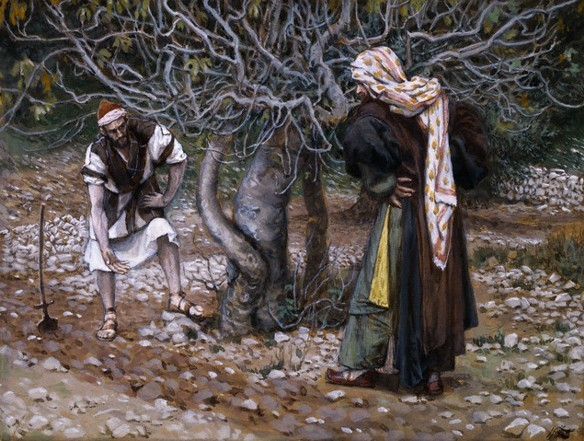
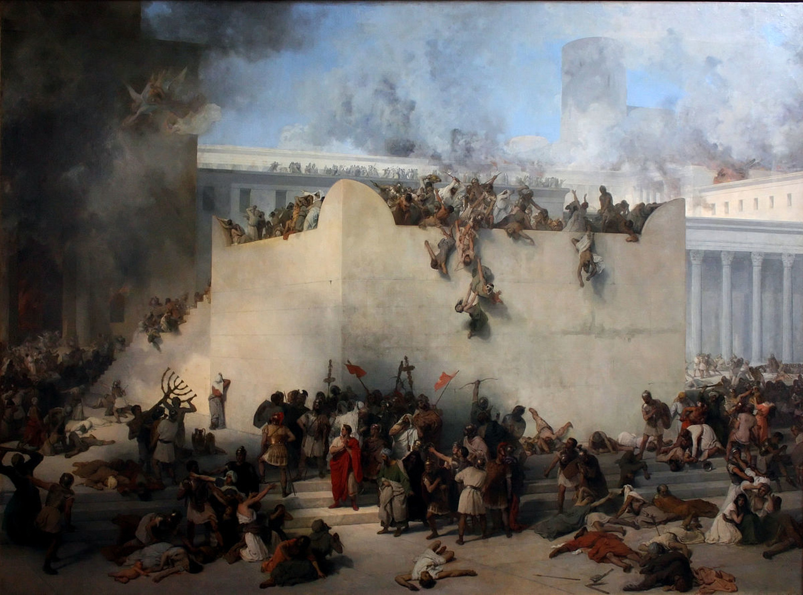

commit 0239726f8b8fd68cac706044a6268f3235ce3322 (HEAD -> master, origin/master, origin/HEAD)
Author: ericclero <eric_stefanon@msn.com>
Date:   Fri Nov 9 10:29:45 2018 -0200

    adicionado capitulo 12 e 13 e algumas correcoes

diff --git a/images/destruicao-do-templo.jpg b/images/destruicao-do-templo.jpg
new file mode 100644
index 0000000..ab583c3
Binary files /dev/null and b/images/destruicao-do-templo.jpg differ
diff --git a/images/figueira_esteril.jpg b/images/figueira_esteril.jpg
new file mode 100644
index 0000000..1843132
Binary files /dev/null and b/images/figueira_esteril.jpg differ
diff --git a/images/viuva-pobre.jpg b/images/viuva-pobre.jpg
new file mode 100644
index 0000000..a42f9d8
Binary files /dev/null and b/images/viuva-pobre.jpg differ
diff --git a/index.html b/index.html
index d5d42e8..bfcdcef 100644
--- a/index.html
+++ b/index.html
@@ -64,6 +64,7 @@
                 font-style: italic;
                 text-shadow: 1px 1px 1px;
                 letter-spacing: -0.08em;
+                text-transform: capitalize;
                 
             }
             h1, h2, h4, h5{
@@ -78,6 +79,12 @@
                 background-color: beige;
             }
             
+            li {
+                font-style: italic;
+                list-style-position: inside;
+                
+            }
+            
             main {
                 width: 955px;
                 margin: -1px auto 10px;
@@ -107,6 +114,7 @@
             nav ul li a{
                 padding: 5px 15px;
                 font-size: 1.20em;
+                font-style: normal;
                 color: 	#8B4513;
                 text-decoration: none;
                 
@@ -199,7 +207,7 @@
                     <li>Autoridade reconhecida pelos homens: o texto não mostra margem para negativa, os que foram chamados prontamente o seguiram (vers. 17 a 20).</li>
                 </ol>
 
-                
<b>Prática:</b> Não conseguimos viver um vida 100% livre, sem que haja alguma autoridade em nossas vidas. Às vezes, temos péssimos exemplos delas e muito facilmente acabamos acreditando que autoridade é sinônimo de arrogância, abuso e desrespeito. E tão logo deixamos de confiar na autoridade de Cristo que é perfeita, justa e santa. 

+                
<b>Prática</b>: Não conseguimos viver um vida 100% livre, sem que haja alguma autoridade em nossas vidas. Às vezes, temos péssimos exemplos delas e muito facilmente acabamos acreditando que autoridade é sinônimo de arrogância, abuso e desrespeito. E tão logo deixamos de confiar na autoridade de Cristo que é perfeita, justa e santa. 

 
                 
<b>Oração</b>: Deus, ajuda-me a confiar que sobre tudo Tu és Senhor. Não há nenhuma área de minha vida que posso deixar fora do alcance da sua autoridade. É o que oro, em teu nome, amém!

 
@@ -218,7 +226,7 @@
                 
<b>Observação</b>: Jesus, com alguns discípulos, volta a Cafarnaum, onde havia ensinado em uma sinagoga, expulsado espíritos imundos e realizado muitos sinais na cidade conforme capítulo 1. Desta vez, realiza o milagre da cura do paralítico, mostrando aos mestres da lei que possuía autorizade para perdoar pecados. Em seguida, anda com pecadores, inclusive chama um para ser seu discípulo (Levi), isso causa grande desconforto entre os líderes, que não percebem a missão de Cristo. Suas atitudes são comparadas a quem tendo a roupa toda rasgada, velha, desfiando, tenta costura-la com tecido novo. Pois cuidam de todos os detalhes da lei, mas esquecem o principal.

 
 
-                
<b>Prática:</b> Como os líderes da época de Jesus, posso acabar olhando para muitas coisas secundárias (jejum, dias da semana, o que pode ou não pode) e torná-las o principal da fé. Não que não sejam parte da vida cristã, mas não devem tomar o lugar de Cristo. Cristo seguia a lei, mas seu propósito era andar com pecadores para fazer a vontade do Pai e trazer salvação aos perdidos. 

+                
<b>Prática</b>: Como os líderes da época de Jesus, posso acabar olhando para muitas coisas secundárias (jejum, dias da semana, o que pode ou não pode) e torná-las o principal da fé. Não que não sejam parte da vida cristã, mas não devem tomar o lugar de Cristo. Cristo seguia a lei, mas seu propósito era andar com pecadores para fazer a vontade do Pai e trazer salvação aos perdidos. 

 
                 
<b>Oração</b>: Senhor, ensina-me a entender para o que fui chamado. Que Cristo seja o exemplo a ser seguido, e não deixe que a mensagem dEle seja substituída por discussões inúteis. Em nome de Jesus. Amém.

 
@@ -239,7 +247,7 @@
                 
<b>Observação</b>: Nesse capítulo algumas coisas continuam a acontecer, que já foram vistas nos anteriores: Jesus é confrontado pela hipocrisia dos mestres, Ele realiza mais milagres, outra vez espíritos imundos reconhecem sua natureza como Filho de Deus e Ele termina a lista de discípulos. Jesus se torna mais conhecido pelos seus milagres, a ponto de grandes multidões serem um risco a sua segurança (Vers. 9) e a sua saúde (20), sua família tenta impedi-lo, mas Jesus chama esses que o buscam de sua família. Ele não reclama das privações que enfrenta por anunciar o Reino que Ele mesmo inaugurará.

 
 
-                
<b>Prática:</b> A vida de Cristo foi marcada pelas privações. Todos são chamados a anunciar a vinda do Reino dele, e não há forma de cumprir essa comissão sem privação de tempo, luxo, dinheiro e de si próprio. Mas, por mais que isso pareça um peso, quando Jesus nos dá o mesmo amor que ele teve pelos que chamou de família, somos confortados, pois sabemos que muitos são alcançados e o nosso esforço não é vão. 

+                
<b>Prática</b>: A vida de Cristo foi marcada pelas privações. Todos são chamados a anunciar a vinda do Reino dele, e não há forma de cumprir essa comissão sem privação de tempo, luxo, dinheiro e de si próprio. Mas, por mais que isso pareça um peso, quando Jesus nos dá o mesmo amor que ele teve pelos que chamou de família, somos confortados, pois sabemos que muitos são alcançados e o nosso esforço não é vão. 

 
                 
<b>Oração</b>: Deus, que o seu amor pelos que chama de família seja presente em nosso meio, que eu entenda que a família da fé não são só os convertidos, mas são todos os espalhados pela terra que ainda terão esse encontro com Cristo. Dá-me ânimo e coragem para enfrentar qualquer privação em seu nome, amém.

 
@@ -258,7 +266,7 @@
                 
<b>Observação</b>: Jesus mais uma vez está pregando para um multidão. Dessa vez, utiliza as parábolas para ensinar. Aliás, esse capítulo é quase todo formado por elas. Através delas, Cristo nos ensina que o anúncio do evangelho encontra corações que podem ser férteis ou inférteis, que devemos refletir a luz de Deus, que o crescimento do reino vem de Deus e que esse reino é grandioso. E apesar da comparações das parábolas envolverem coisas simples, só há entendimento a quem é permitido.

 
 
-                
<b>Prática:</b> Para entender o reino, devemos primeiro entender o significado da parábola do semeador. Entender que nos é comissionado o anúncio do evangelho, que a semente sempre será a mesma, o solo muda, o semeador também, mas a semente é a mesma.  

+                
<b>Prática</b>: Para entender o reino, devemos primeiro entender o significado da parábola do semeador. Entender que nos é comissionado o anúncio do evangelho, que a semente sempre será a mesma, o solo muda, o semeador também, mas a semente é a mesma.  

 
                 
<b>Oração</b>: Deus, obrigado por nos ser permitido entender os segredos do teu reino. Que a cada dia mais entendimento possa me ser dado, em teu nome. Amém.

 
@@ -277,7 +285,7 @@
                 
<b>Observação</b>: Nesse capítulo, temos relatos de grandes milagres de Jesus: Ele exerce seu poder sobre uma legião de demônios para libertar um homem possesso; cura uma enfermidade que fora tratada sem resultado por 12 anos; e realiza uma ressurreição. No primeiro, não há menção sobre fé, Cristo liberta o homem possesso e o manda anunciar a misericórdia de Deus entre os de sua casa. Nos dois últimos, Jesus mostra que a fé é importante em seu ministério (v. 34 e v. 36). 

 
 
-                
<b>Prática:</b> O mesmo Jesus que realizou sinais e milagres, ainda faz isso em nosso meio. E a forma como ele trabalha não depende de nossa fé, como no caso do homem possesso, que foi liberto graças a misericórdia de Deus. Mas ainda assim, somos chamados a ter fé na obra de Jesus.  

+                
<b>Prática</b>: O mesmo Jesus que realizou sinais e milagres, ainda faz isso em nosso meio. E a forma como ele trabalha não depende de nossa fé, como no caso do homem possesso, que foi liberto graças a misericórdia de Deus. Mas ainda assim, somos chamados a ter fé na obra de Jesus.  

 
                 
<b>Oração</b>: Deus, tenho contato com os relatos de milagres que Jesus realizou enquanto na terra. Vejo as coisas que faz em minha vida, e não são poucas. Mas ainda assim tenho uma mente cética e uma fé, que a qualquer momento, por qualquer circunstância, vacila em ter confiança. Peço perdão e que o Senhor fortaleça minha fé em seu Nome. Amém.

 
@@ -296,7 +304,7 @@
                 
<b>Observação</b>: Temos nesse trecho o relato da morte de João Batista. João Batista é mencionado no primeiro capítulo como o que clama no deserto para que preparassem o caminho do Senhor. Ele pregava um batismo de arrependimento para o perdão de pecados. Naturalmente, vendo o pecado de Herodes, não se calou e anunciou arrependimento, mesmo com o risco envolvido em contrariar o poder de Herodes. Da parte de Herodes até havia um certo respeito e admiração por João, mas isso de nada serviu, já que para satisfazer os caprichos de Herodias, optou por decapitar João Batista. Sendo um servo fiel, João, a quem foi concedido o privilégio de batizar o Filho de Deus, não foi poupado de uma morte que foi fruto do que há de pior no ser humano, capaz de tirar a vida por razões tão baixas. Outro detalhe observado é que o texto não tenta justificar Deus por permitir tal coisa. 

 
 
-                
<b>Prática:</b> Perseguições e todo tipo de violência contra cristãos que anunciam arrependimento ainda existem em nosso mundo, apesar que não no contexto que vivemos. A Bíblia e a história estão cheias de relatos de sofrimento e martírio de pessoas justas. A Palavra de Deus não faz meia-culpa em tentar desculpar Deus por isso. E também não impede que o homem demonstre sua indignação contr a Deus. Não há certeza que teremos uma vida tranquila quando pregamos arrependimento, talvez muito pelo contrário, e se esperamos isso aqui, seremos infelizes e nos frustaremos com Deus. Mas a segurança que devemos ter está na vida vindoura. Esta, nada poderá nos privar.  

+                
<b>Prática</b>: Perseguições e todo tipo de violência contra cristãos que anunciam arrependimento ainda existem em nosso mundo, apesar que não no contexto que vivemos. A Bíblia e a história estão cheias de relatos de sofrimento e martírio de pessoas justas. A Palavra de Deus não faz meia-culpa em tentar desculpar Deus por isso. E também não impede que o homem demonstre sua indignação contr a Deus. Não há certeza que teremos uma vida tranquila quando pregamos arrependimento, talvez muito pelo contrário, e se esperamos isso aqui, seremos infelizes e nos frustaremos com Deus. Mas a segurança que devemos ter está na vida vindoura. Esta, nada poderá nos privar.  

 
                 
<b>Oração</b>: Cristo, ajude a olhar para o seu exemplo de perseverança. Que a minha confiança no poder da sua obra cresça a cada dia. Peço coragem para enfrentar qualquer consequência que possa passar por pregar um evangelho de arrependimento. Em seu nome oro, amém!

 
@@ -315,7 +323,7 @@
                 
<b>Observação</b>: O ministério de Jesus havia chamado a atenção dos fariseus e mestres da lei (v. 1). Vieram de Jerusalém cheios de si, com um conjunto de tradições, para avaliar se Cristo era de fato o Messias prometido. Ao se encontrarem com Jesus, a pergunta que fazem já mostra o problema: "Por que os seus discípulos não seguem a <b>tradição dos líderes religiosos?</b>" (v. 5) Eles haviam trocado o direcionamento santo, dado por Deus, por um conjunto de regras, produto daqueles que deveriam ser o exemplo para o povo. O externo demostrava zelo, abnegação e compromisso, contudo o coração estava longe, pois o que seguiam eram doutrinas humanas (v 7). 

 
 
-                
<b>Prática:</b> Os discípulos, talvez por estarem envolvidos nesse ambiente religioso legalista, não entenderam a crítica de Jesus (v. 17). Será que nós que um dia entramos em uma comunidade, já com um conjunto de doutrinas formado, agimos com o senso crítico de Jesus ou estamos mais como os discípulos que não entenderam? Será que avaliamos se o que seguimos é doutrina de Cristo ou humana?   

+                
<b>Prática</b>: Os discípulos, talvez por estarem envolvidos nesse ambiente religioso legalista, não entenderam a crítica de Jesus (v. 17). Será que nós que um dia entramos em uma comunidade, já com um conjunto de doutrinas formado, agimos com o senso crítico de Jesus ou estamos mais como os discípulos que não entenderam? Será que avaliamos se o que seguimos é doutrina de Cristo ou humana?   

 
                 
<b>Oração</b>: Pai, que meu coração seja limpo de toda forma de auto-justificação. Me livre das regras que eu crio para que eu mesmo siga e me sinta merecedor de alguma coisa. Em nome de Jesus, amém!

 
@@ -334,7 +342,7 @@
                 
<b>Observação</b>: Jesus aqui continua se movimentando de lugar a lugar, passando por desertos e atravessando águas de barco, enquanto realiza sinais e ensina sobre a realidade do Reino de Deus. Nesse trecho, ao atravessarem para o outro lado do mar, os discípulos, que haviam presenciado duas multiplicações de alimento, começam a discutir o que haveriam de fazer, já que tinham apenas um pão. Jesus os questiona se eles ainda não haviam entendido que o ministério que os seria dado, envolveria o alimento espiritual para aqueles que estão sedentos. Jesus pode ter feito uma terceira multiplicação para saciar os discípulos, mas como não é relatado, é provável que eles tenham passado fome, e que lhes tenha sido ensinado a confiar em Jesus, mesmo nos momento de falta.  

 
 
-                
<b>Prática:</b> Quantas vezes sou influenciado pelo fermento dos fariseus e de Herodes, e me encontro colocando o externo e o secundário, como as preocupações principais da minha vida. Jesus nos ensina a buscar o Reino em primeiro lugar enquanto que as demais coisas nos são dadas, mas como é fácil viver preocupado com as demais coisas, como os discípulos estavam, se esquecendo que temos junto de nós aquele que multiplica o pão e tem compaixão dos que tem fome.    

+                
<b>Prática</b>: Quantas vezes sou influenciado pelo fermento dos fariseus e de Herodes, e me encontro colocando o externo e o secundário, como as preocupações principais da minha vida. Jesus nos ensina a buscar o Reino em primeiro lugar enquanto que as demais coisas nos são dadas, mas como é fácil viver preocupado com as demais coisas, como os discípulos estavam, se esquecendo que temos junto de nós aquele que multiplica o pão e tem compaixão dos que tem fome.    

 
                 
<b>Oração</b>: Deus, fortalece minha confiança no Senhor, me ajuda a levar sua mensagem aos que tem fome. Que eu coloque as coisas no seu lugar, que as preocupações com as outras coisas não me faça esquecer que o Senhor é dono de tudo. Oro em teu nome, amém!

 
@@ -353,7 +361,7 @@
                 
<b>Observação</b>: Este é um capítulo que trata muito da natureza de Jesus e das manifestações do Reino que estavam por vir. No vers. 1, Jesus diz que o Reino de Deus chegaria com grande poder ainda naquela geração, possivelmente estava se referindo a sua ressurreição (talvez também ao Pentecostes?). Dos  vers. 2 a 7, alguns discípulos tem um vislumbre da glória que habita em Jesus e no vers. 9, ele menciona sua ressurreição, assim como no vers. 31. Jesus trata a vinda do Reino como eminente, e dos vers. 42-48, ele alerta que devemos estar preparados para as duas realidades que esse Reino traz: uma que leva a vida e outra de sofrimento eterno. Essa preparação demanda abnegação daquilo que nos faz tropeçar.  

 
 
-                
<b>Prática:</b> Assim como Cristo estava prestes a morrer e ressuscitar no tempo do relato do Cap. 9, hoje ele está também para nós, preste a voltar. Da mesma forma, devemos estar preparados, sabendo identificar os sinais que antecedem a sua vinda, pedindo o discernimento para identificar as nossas pedras de tropeço, e capacidade para abandoná-las. E, mais importante ainda, não ser tropeço para os que são novos na fé.     

+                
<b>Prática</b>: Assim como Cristo estava prestes a morrer e ressuscitar no tempo do relato do Cap. 9, hoje ele está também para nós, preste a voltar. Da mesma forma, devemos estar preparados, sabendo identificar os sinais que antecedem a sua vinda, pedindo o discernimento para identificar as nossas pedras de tropeço, e capacidade para abandoná-las. E, mais importante ainda, não ser tropeço para os que são novos na fé.     

 
                 
<b>Oração</b>: Deus, ajuda-me a estar preparado para a vinda do seu Reino. Que eu esteja atento as manifestações da vinda de Cristo e também atento ao que me faz tropeçar. Creio que um dia virá com poder e glória, mas ajuda na minha falta de fé. No nome de Jesus. Amém!

 
@@ -372,7 +380,7 @@
                 
<b>Observação</b>: Jesus havia acabado de conversar com o jovem rico, e explicado a seus discípulos que dificilmente um rico entraria no reino de Deus. Como no caso do jovem, que havia quebrado o primeiro mandamento, pois seu coração estava nas riquezas . Na verdade, mais que isso, no vers. 27 nos é ensinado que é impossível que o homem se salve. No vers. 28, Pedro percebe a diferença que houve entre os discípulos que prontamente abandonaram tudo para seguir Jesus e o jovem que deixou Jesus, por não ser capaz de vender seus bens. E pela graça de Deus, temos no vers. 29 e 30, uma promessa de prosperidade: mesmo que percamos bens, família e amigos por causa de Cristo, receberemos uma nova família, que estará disposta a nos ajudar nas necessidades, e de maneira, recíproca, ajudaremos quando tivermos capacidade. E acima de tudo, temos a promessa da vida eterna.   

 
 
-                
<b>Prática:</b> Adorar a Deus sobre todas as coisas não é simples, na verdade é impossível para o homem. Nosso coração sempre busca adorar algo ou alguém no lugar de Deus, mas para seguir Jesus precisaremos abandonar aquilo que consideramos como a coisa mais importante de nossas vidas, aquilo que julgamos ser o que mais nos fará falta. Mas Cristo nos mostra que, de forma alguma, nos arrependeremos disso. Ainda que passemos por perseguições por causa do nome dele, podemos contar que ele não nos abandonará.      

+                
<b>Prática</b>: Adorar a Deus sobre todas as coisas não é simples, na verdade é impossível para o homem. Nosso coração sempre busca adorar algo ou alguém no lugar de Deus, mas para seguir Jesus precisaremos abandonar aquilo que consideramos como a coisa mais importante de nossas vidas, aquilo que julgamos ser o que mais nos fará falta. Mas Cristo nos mostra que, de forma alguma, nos arrependeremos disso. Ainda que passemos por perseguições por causa do nome dele, podemos contar que ele não nos abandonará.      

 
                 
<b>Oração</b>: Deus, te agradeço pelas pessoas que tem colocado em minha vida. Pois a partir do momento em que passei a te seguir, além da família de sangue, o Senhor me deu irmãos com quem posso contar. Me faça estar atento às necessidades do que são da minha família. Em seu nome, amém! 

 
@@ -391,16 +399,89 @@
                 
<b>Observação</b>: O texto descreve algumas ideias que se contrapõe: Jesus é recebido de forma calorosa, como a um rei, pela cidade que mais tarde o condena; Jesus avista uma figueira cheia de folhas, mas ao chegar perto, vê que está sem frutos; o templo está "cheio de vida", com muitas pessoas, mas não há ali santidade, deveria ser casa de oração, mas é chamada casa de salteadores. 

 
 
-                
<b>Prática:</b> Cristo está purificando a sua igreja. O joio ainda é presente, e em alguns casos, é difícil acreditar que haja ali trigo. Mas Ele continua realizando sua obra, fazendo com que sua casa seja conhecida como casa de oração. A nossa responsabilidade é ser como uma figueira cheia de frutos, para que em meio a um ambiente mal, as pessoas possam ver a luz que vem de Cristo. 

+                
<b>Prática</b>: Cristo está purificando a sua igreja. O joio ainda é presente, e em alguns casos, é difícil acreditar que haja ali trigo. Mas Ele continua realizando sua obra, fazendo com que sua casa seja conhecida como casa de oração. A nossa responsabilidade é ser como uma figueira cheia de frutos, para que em meio a um ambiente mal, as pessoas possam ver a luz que vem de Cristo. 

 
                 
<b>Oração</b>: Obrigado pela igreja sadia que o Senhor me permitiu participar. Que a cada dia ela esteja dando mais frutos para a sua glória. E que nesse processo o Senhor esteja me usando. Em seu nome, amém! 

 
                 

<a href="#topo">Voltar ao topo</a>


                 
+                <h2 id="marcos_11"><a href="http://www.mundocristao.com.br/41/Marcos-11" target="_blank">Marcos 11:20-33</a>: De Onde Vem Sua Autoridade?</h2>
+
+                <figure>
+                     
+                    <figcaption>
+                        Figueira Estéril
+                    </figcaption> 
+                </figure>
+
+
+                
<b>Observação</b>: Jesus novamente é confrontado pelo fariseus e líderes. Dessa vez, o questionam de onde vinha a autoridade para essas coisas que Jesus fazia. Ora, que são "essas coisas"? São os milagres e sinais que testificam a autoridade de um profeta, ou seja, os fariseus já tinham tudo o que precisavam para assumir a autoridade divina de Cristo. Mas mesmo assim, Jesus os responde mencionando João Batista, outro reconhecido como profeta, para testificar sua natureza divina. Mas as motivações dos fariseus eram outras, pela sua discussão que tiveram entre si, percebe-se que não estavam preocupados com a verdade, mas com as consequências que cada uma das possíveis repostas teria a excelente pergunta de Jesus. 

+
+
+                
<b>Prática</b>: Quais são nossas motivações para estar no igreja? Será que o conforto social de ter pessoas que pensam parecido conosco não é o que nos atrai? Talvez o senso de ser útil para a sociedade quando nos envolvemos em algum projeto social, ou mesmo a reputação que a igreja nos dá? Não há nenhuma outra motivação que Cristo reconheça que não a de querer estar debaixo da sua autoridade.  

+
+                
<b>Oração</b>: Deus, sabe como meu coração é enganoso. Também sabe como minhas intenções muitas vezes tendem a fugir do propósito, que é o de te adorar e te dar toda a glória. Peço que purifique todos os dias as minhas motivações. Amém. 

+
+                

<a href="#topo">Voltar ao topo</a>


+                
+                
+                <h2 id="marcos_12"><a href="http://www.mundocristao.com.br/41/Marcos-12" target="_blank">Marcos 12</a>: o grande mandamento</h2>
+
+                <figure>
+                     
+                    <figcaption>
+                        A Viúva Pobre
+                    </figcaption> 
+                </figure>
+
+
+                
<b>Observação</b>: Ao longo de seu ministério, Jesus foi questionado pelos líderes religiosos inúmeras vezes. De acordo com o relato de Marcos, essas foram algumas perguntas: 
+                    <ol>
+                        <li>É lícito ao marido repudiar sua mulher?</li>
+                        <li>Por que não andam os seus discípulos de conformidade com a tradição dos anciãos, mas comem com a mão por lavar?</li>
+                        <li>Por que motivo jejuam os discípulos de João e os dos fariseus, mas os seus não jejuam?</li>
+                        <li>Por que come com publicanos e pecadores?</li>
+                    </ol>
+                Já no capítulo 12, temos duas perguntas: 
+                    <ol>
+                        <li>É lícito pagar tributo a César ou não?</li>
+                        <li>Qual é o principal de todos os mandamentos?</li>
+                    </ol>
+                A primeira pergunta, como as outras feitas pelos líderes, é carregada de hipocrisia como notado por Jesus. A segunda talvez o tenha alegrado, pois deu margem para que se falasse do que é o resumo de toda a lei. O escriba autor da pergunta percebeu que se estamos diante de alguém que se diz Deus, não faz sentido perguntar sobre detalhes e questões de pode ou não pode. Mas foi no ponto central ao querer saber qual é o maior dos mandamentos, qual é a principal vontade de Deus.
+                

+
+
+                
<b>Prática</b>: Jesus vê valor na pergunta do escriba. Reconhece que ele não está longe do Reino de Deus. Talvez ele seja como o jovem rico, que entendeu que devemos amar a Deus sobre todas as coisas e o próximo como a nós mesmo, mas que não colocou isso em prática. Ou seja, fazer parte do Reino de Deus implica que esses dois mandamentos façam parte de nossa vida. Se não fizerem, estamos apenas próximos ao Reino, mas não nele.    

+
+                
<b>Oração</b>: Deus, conduza nossas vidas nas obras que nos foram preparadas de antemão. Não permita que apenas saibamos a importância de amar a Ti sobre todas a coisas e ao próximo como a nós mesmo. Mas que essa seja uma marca das nossas ações. Que o amor de Cristo seja visto através dessa prática em nossas vidas. Em seu nome, amém! 

+
+                

<a href="#topo">Voltar ao topo</a>


+            
+                <h2 id="marcos_13"><a href="http://www.mundocristao.com.br/41/Marcos-13" target="_blank">Marcos 13</a>: as últimas coisas</h2>
+
+                    <figure>
+                         
+                        <figcaption>
+                            A Destruição do Templo de Jerusalém
+                        </figcaption> 
+                    </figure>
+
+
+                    
<b>Observação</b>: Todo o capítulo 13 fala sobre as últimas coisas, por isso se assemelha muito ao livro de Apocalipse. Nesse capítulo temos profecias que se concretizaram já naquela geração, como a destruição do templo de Jerusalém, as perseguições que passariam os discípulos e os cristãos naquele tempo, mas também temos profecias que ainda estão por acontecer. Portanto, desde a primeira vinda de Cristo, já foi inaugurado o fim dos tempos e a principal profecia - a segunda vinda de Cristo - está por acontecer. 
+                    

+
+
+                    
<b>Prática</b>: Vivemos na iminência da volta de Cristo. Enquanto esperamos, todo tipo de tribulação, ódio entre familiares e falsos mestres realizando sinais e prodígios podem nos desviar do caminho, contudo pela graça de Deus, ele abrevia os dias para manter a perseverança de seus eleitos. Não sabemos quando se dará, mas somos alertados por Jesus a esperá-lo em santidade.    

+
+                    
<b>Oração</b>: Deus, suas promessas não falham. A história mostra sua fidelidade em cumprir suas palavras, sejam elas de juízo ou misericórdia. Um dia Jesus voltará em glória e tomará sua noiva. Enquanto isso, santifica sua igreja, e ajude-nos a confiar que o domínio dos tempos está em suas mãos. Amém! 

+
+                    

<a href="#topo">Voltar ao topo</a>


+                
                 <address>Contato: <a href="mailto:eric_stefanon@msn.com">eric_stefanon@msn.com</a></address>
 
             </article>
         </main>
+        
         <footer>&copy;Copyright 2018 - Eric Stefanon von Dietrich.  Todos os direitos reservados. </footer>
         
     </body>

commit 3c82847ca4a8ee9cb6ab442613fb74dc6402817c
Author: ericclero <eric_stefanon@msn.com>
Date:   Fri Nov 9 09:23:17 2018 -0200

    pequenas modificacoes

diff --git a/index.html b/index.html
index f0c2afe..d5d42e8 100644
--- a/index.html
+++ b/index.html
@@ -6,7 +6,7 @@
         <meta charset="utf-8">
         <meta name="author" content="Eric Dietrich" >
         <meta name="language" content="pt-br">
-        <meta name="description" content="Diário Espiritual">
+        <meta name="description" content="Textos devocionais criados a partir da proposta de diário espiritual. Utilizando a sigla TOPO: Texto, Observação, Prática e Oração">
         <meta name="keywords" content="diario, espiritual, marcos, naves imperiais, bíblia">
         <title>Naves Imperiais</title>
         <link rel="icon" href="favicon.ico" />
